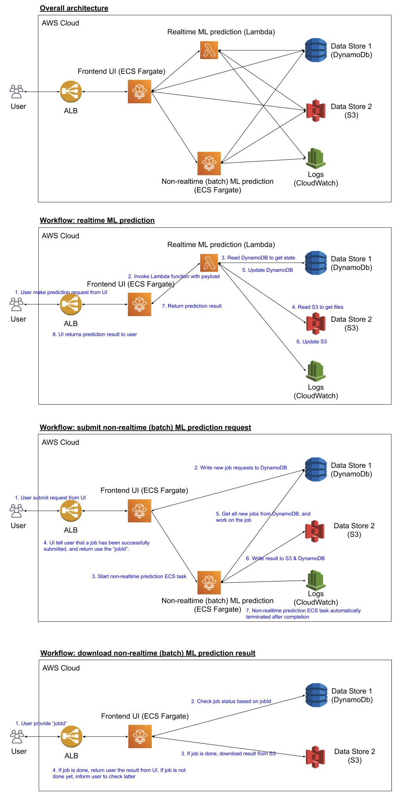

# A Simple Framework for Creating Machine Learning Application

## Introduction

### User Story

- As a data scientist, I solve business problems by applying machine learning algorithms. Solving problem is not a problem for me. However, after I have developped the algorithm, I am having difficulty to prototype my algorihtm to demonstrate its value to stakeholders for several reasons.

- First, I don't have engineering resouces to build the UI and backend infrastructure for my algorihtm prorotype. Second, because the algorithm is still preliminary and is constantly changing/evolving, it is VERY difficult to work with other engineers to build the prototype system. You cannot ask an engineering team to build a system where the core algorithm is changing on a weekly basis, if not daily.

- Therefore, I need a framework to:

    1. Build a machine leawring application prototype system, including UI, database, and network infrastructure, `all by myself`. And it should be `easy to do` and require only `minimal maintenance`. I just want to use minimal effort to build a workable prototype that can demonstrate/provide value.

    2. Perform `quick iterations` of the algorithms.

    3. Allow stackholders (mostly non-technical internal users) to `use the application from UI` and provide feedback.

### Goal

- An `serverless architecture` for hosting `machine learning prototype` that are `scalable`, `easily maintaiable`, and `cost effective` for `research scientists`.

  - The type of machine learnig algoirhtm is not the focus. It is the `serverless architecture` that we are interested in.

    - We choose `serverless` to reduce the on-going maintance work.

  - We are interested in hosting `machine learning prototype`. It is a `prototype`, which means the goal is to demonstrate the machine learning model, and fancy UI is not the focus. For `machine learning`, there are generically two types of predictions. The first type is realtime prediction, that is, prediction that can happen within minutes. The second type is non-realtime (or batch) prediction, that is, prediction that may take minutes to hours to complete. And due to the complexity of machine learing applications, it requires a heavy computing engine, e.g., 10+ GB of memory and/or high-end CPU and/or high-end GPU.

  - The application should be `scalable`. That is, the application should work even if there are 100+ users that is using the application.

  - The application should be `easily maintaiable`. We are a reserach scientists, and not dev ops. We are not interested in spending a lot of time and effort to maintain the application. We want to reduce the maintenance as much as possible.

  - The application shoudl be `cost effective`. In other words, we want to seperate long-running tasks (such as UI frontend) and short-lived compute engine (such as the prediction services). To control the cost, we should NOT createa BIG machine that hosts everything, as it will be expensive.

  - We are `research scientists`. We have greate math skill and can create algorithms to solve business problems. However, we need to way to quickly show the world our achievement.

### Targeted user

- You are a research scientist looking for a easy way to create a machine learing application prototype.

- You are good at machine learning. You are comfortable with using various packages of to create machine learning algorithms.

- You are comfortable working with Python, Makefile, Docker, and AWS resrouces.

- You dp NOT need to have the skill to write professional UI using JavaScript/HTML/CSS. But of course, if you know, it is better.

### Framework Expectation

We expect the framework to deliver the following characteristics.

1. All applications are dockerized, and should be able to developped locally, and tested locally.

    - We want all applications to be dockertized for reproducibility ease of sharing.

    - Assuming we have two machine learing algorihtms and a UI frontend. They should be dockerized indepenedently, which means they can different dependency requirements.

    - Since we are in the early stage of developing the whole system, it is EXPECTED to make errors and/or change algorithms. Therefore, to reduce the friction of development cycle, we need all aogirhtms to be able to run locally and tested locally.

2. We want a framework that are flexible (loosely coupled)

    - To promote loosely coupling, we assume different contaienrs do NOT talk to each other directly. There communcation are through 3rd party, such as DynamoDB, AWS CLI, or S3. While this may not be the most efficient way compared to a mdssage bus architecture, this assumption simplies the architecgture complexity significantly.

3. We want a framework that is serverless.

    - As a data scientist, I am NOT interested in maintaining infrastructure. So I prefer serverelss architecture so that the infrastructure maintanance is handled by the service provider such as AWS.

## Architecture

[Source](https://docs.google.com/drawings/d/1XFEogSXvjYJVDbUxh9cotJs3w1R5XU13H00o495ZPfk/edit?usp=sharing)

[Sample machine learning application](http://ml-app-alb-1112199550.us-east-1.elb.amazonaws.com:8501/)



### Components

1. DynamoDB
    - It stores state for ML prediction applications.

2. S3
    - It stores the prediction result for ML applications.

3. ECR
    - It stores the docker images for the UI frontend, the realtime ML application, the and non-realtime ML application.

4. Lambda
    - It serves realtime ML prediction using serverless fashion.
    - Our Lambda function is created based on ECR image.

5. ECS (Fargate)
    - We define two ECS Fargate tasks. The first task is frontend UI task, and the second task is non-realtime ML prediction task.
    - The frontend UI task is a long-running task that is serving the UI.
    - The non-realtime ML prediction task is a short-lived task that is responsible for producing non-realtime ML predictions. It will run only if there is new non-realtime jobs to do. And cone all jobs are done, it will auto shutdown (to save cost).

6. Application Load Balancer (ALB)
    - ALB provides a fixed DNS for users to access the UI. It routes traffic to one of the frontend UI tasks.

7. Cloud Watch
    - All services/tasks will write its log to cloud watch for debugging purpose.

### Frontend UI

- The frontend UI is served by ECS Fargate.

- User hit ALB, and ALB route the traffic to one of the ECS Fargate frontend tasks. It is scalable as we can increase the number of frontend tasks easily. And there is no impact to user as the DNS remains the same.

### Backend 1: realtime prediction

- We servce realtime prediction as `invoking a Lambda function`, where the Lambda function is created from the docker image that we pushed to ECR.

  - Since we create Lambda function baesd on a docker image, we can test our Lambda function locally BEFORE we push it. All we need to do is to make sure the docker image can be ran successfully locally, which is what data scientists are very familar with.

  - To simulate the whole `create a Lambda function baed on docker image localy`, we can use the Lambda emulator provided by AWS. See [AWS tutorial here](https://aws.amazon.com/blogs/aws/new-for-aws-lambda-container-image-support/).

  - Since our Lambda function is based on a docker iamge, we can do WHATEVER WE WANT, as long as it can be dockerized. This is a new Lambda feature that was recently released (Dec 2020).

- Since Lambda is serverless and have very good scability, this is a reliable and scalable way for serving realtime prediction.

- Lambda function access DynamoDB and/or S3 for steats and files. DynamoDB and S3 are highly available and scalable. And they require almost no maintenance, which is good for our use case.

- Drawback

  - Inoking Lambda function the frist time takes longer (1 - 5 second in my test), while regular invoking takes shorter (50 milliseconds) This is a well known problem called `cold start`.

  - This problem can be resolved by setting up provisioed concurrency. See [AWS blog](https://aws.amazon.com/blogs/compute/new-for-aws-lambda-predictable-start-up-times-with-provisioned-concurrency/) for more detail.

### Backend 2: non-realtime prediction

- We serve non-realtime prediction by desining it as a `ECS Fargate task`. Once it is started, it will query DynamoDB to find all the new jobs. It will work on the new jobs, and update DynamoDB and/or S3 with the result. When all jobs are done, it will terminate itself.

- There is NO service to manage this task. When user submit a non-realtime job from the UI, the frontend will send this new job information to DynamoDB and `run` the non-realtime task. And cone the task is done, it will terminate itself. This is a very good way to run complex machine jobs without keeping a big long-running machine.

- And since it is based on docker image, we can test the code locally, and only upload it once it works.

### Advantages of this architecture

1. Serverless

    - All the components in the architecdture are serverless. So this means we do not need to manage any instances or servers.

2. Scalable

    - The whole architecture is highly scalable. 

    - If there are too many users accessing UI, we can simply increase the number of frontend tasks (configurable from ECS service definition). There is no interuption to the user as user access UI via ALB.

    - For realtime prediction, it is served by Lambda. So it is scalable by default.

    - For non-realtime prediction, it is a batch processing. So user expect to have some delay.

    - For data store, DynamoDB and S3 are scalable by design. And in case there are too many activities, we can increase the RSU and WSU for DynamoDB table.

3. Relatively easy to set up for a single research/data scientist

    - The `easiest` way to set up machine learning application is to createa a VM, and run all tasks on that single VM. This is the classical architecture, which we know works. However, this architecture is not scalable by design. It is not falt tolerant, and require a lot of maintanance (like manually restart the server, etc).

    - The `ideal` way to set up machine learning application is to pair up data scientist with DevOps. Data scientist is responsible for the core prediction logic, and the devop is responsible for the infrastructure and day-to-day maintenance. Usually, the application is built and deployed via Kubernetes. Since everything can be customized in Kubernetes, you can create a scalable and relible system. However, this require a team and is usually very time consuming.

    - Therefore, if we want a scalable ML system that a single data scientist can build, the architecture proposed here is a good solution. It extensivly leverage AWS manged service, but at the same time proivdes enough flexibility to build our application.

    - In terms of the knowledge required, it is not zero but also not too complicated.

        - Docker

        - AWS services: ECR, ECS, Lambda, DynamoDB, S3, ALB

        - Frontend framework (I use treamlit with Python as the frontend framework)

        - ML prediction (this is what every data scientists already know)

4. Loose coupling

    - In this architecture, we have one (or multiple) containers for UI, a container (in the form of Lambda function) for realtime prediction, a container (in the form of ECS Faragte task) for non-realtime prediction. They are `loosely coupled`, as there is no direct connection among them. All the communcation are through AWS CLI, DynamoDB, and S3.

    - The benefit of this is that we do not need to implement a common message bus, which is a population architecture for production-grade Kubernete cluster. However, it is too complex (at least for me). 

## Development Workflow

As a single data scientist, have a easy-to-follow workflow is important. Below is a workflow that I use for this project.

### Phase 1: locally development

1. [Cloud][One time] Create DynamoDB table and S3 bucket

2. [Local] Create, build, and test frontend UI docker image locally

    - Since DynamoDB table and S3 bucket are already created, you can test your code by accessing these services.

3. [Local] Create, build, and test realtime prediction docker image locally

    - Since the realtime docker will be ran on Lambda, you should use the [AWS Lambda emulator](https://aws.amazon.com/blogs/aws/new-for-aws-lambda-container-image-support/) for local testing.

    - Since DynamoDB table and S3 bucket are already created, you can test your code by accessing these services.

4. [Local] Create, built, and test non-reasltime prediction docker image locally

    - Since DynamoDB table and S3 bucket are already created, you can test your code by accessing these services.

### Phase 2: Bring up cloud service

After phase 1, you have all the docker images ready, and have verified that they are working locally. In phase 2, we will push them to AWS and bring up cloud services.

5. [Cloud] Deploy frontend to ECS Fargate

    - Upload the latest frontend docker image to ECR

        - See `make upload_frontend` for example.

    - Create a ECS Fargate task definition to the latest frontend docker image

        - If you want to change the environment variables or change the port, then you need to modify the existing ECS Fargate task by creating a new revision

    - Create a ECS Fargate cluster

    - Create a ECS Fargate service in the created cluster

        - During service creation, you will need to associate it to an ALB. Setting up ALB is tricky as it is very to get wrong with security group or ports.

        - Test and see if you, as a user, can access the ALB. If you cannot, it is most likely due to  VPC, subnet, role/permission, or security group setup.

        - If you update the ECS Fargate task (say, a new version), then you need to update the service.

6. [Cloud] Deploy realtime prediction to Lambda

    - Upload the latest realtime prediction docker image to ECR

        - See `upload_lambda` for example.

    - Create a Lambda function baesd on ECR docker image.

    - Test the Lambda function from AWS Lambda UI. If there is any error, stsop here and debug. Since we have already verify the realtime prediction works locally, the most common errors are VPC, subnet, role/permission, security group. If you log all exceptions when accessing AWS resources, you should be able to find out what's the problem from clodu watch log.

7. [Cloud] Deploy non-realtime prediction to ECS Fargate

    - Upload the latest non-realtime docker image to ECR

        -  See `make upload_backend` for example.

    - Create a ECS Fargate task definition to the latest frontend docker image

    - Manually start the ECS task, and see if it is working as expected. If not, look at the cloud watch logs to debug.

Congragulation! You have a serverless machine learning application up and running! 

## Operation Cost

- For the frontend, we hav a very lightweight frontend (0.5 GB of RAM and 0.25 vCPU). Assuming we run this task 24 hours for 30 days, the total cost is $8.88 USD.

  - See [AWS Fargate pricing](https://aws.amazon.com/fargate/pricing/) for the up-to-date cost.

- For the DynamoDB, we have only 2 RCU and 2 WCU. The monthly cost is about $1.17 USD.

  - In DynamoDB, there are two capacity mode. The first one is `Provisioned`, and the second one is `On-demand`. To get an estimate of the cost, try this [DynamoDB Pricing Calculator](https://dynobase.dev/dynamodb-pricing-calculator/).

- For the non-realtime task, it only runs if there is new jobs to work on. So the cost is negligible.

- For the realtime task, our current code uses only 128 MB of RAM and is completed within 100 ms. So the cost is neglible.

## Others

### Lessons Learned

1. Define constants, especially values realted to AWS resouces, in a `constants.py` file.

    - In this framework, we use various AWS resources when using boto3. Since the arn/name/version of these AWS resources may change, we should define than in `constants.py`, which will make our life easier when there is any change.

2. Important configuration parameters when defining ECS Fargate task

    - Environment varaibles

        - In our example, the UI ask user to input a `password`. Instead of hard coded the expected password in the code, we put it in the environment variable. Admittedly, this is not the `correct` way for doing user authentication, but it is easy to do and serves our purpose.

    - Port to open

        - In our example, streamlit is launched on port 8501. So we need to open port 8501

3. Important configuration parametres when creating ECS service

    - Load balancer

        - Load balance HAS to be configured during service creation time. See [this article](https://appfleet.com/blog/route-traffic-to-aws-ecs-using-application-load-balancer/) for how to createa a ALB for ECS. It will createa a target group, which is the target group that the ALB shoudl rote the traffic to. In my example, it is called `ecs-ml-app-ml-app-frontend-alb` (the naming is going to be different for you).

        - In the load balancer, check the `Listeners`. It should ruote the traffic to the target group associated to your ECS sercie (in my case, `ecs-ml-app-ml-app-frontend-alb`).

    - Security group

        - Make sure the security group associated to this service has the required input port open. In particular, this security group shoudl allow all trafic on all ports from the ALB. This is the ensure the the tasks created by this ECS service can accept inbound traffic from the ALB.

4. Important configuration parametres when creating Lambda function

    - The docker image URL to use from ECR

    - Environment variables

5. You should expect accessing AWS resouce may fail (and it will)

    - We should accessing AWS resource to fail. There are a lot of reasons that it may fail. The common ones are:

        1. Insufficnet permission (usually tied to execution role and permission)

        2. Cannot establish the connection (usually ties to VPC, subnet, or security group)

        3. Transient network failure

    - For EVERY AWS resrouces access, you should wrap it in try-except block and log the exception.

        ```python
        try:
            <do something related to accessing AWS resources>
        except Exception as e:
            logger.error(f"Failed to do .... Exception message: {e}")
        ```

        Since ECS tasks and Lambda function write log to cloud watch, you can use cloud watch to look for the logs and to identify what's wrong with your code.

        Good logging is expecially important for serverless application because there is no persistent instances that you can log in and debug. You have to rely on the log mesage.

    - If possible, implement eponential re-try mechnism.

6. Why we use both DynamoDB and S3 for storing data?

   There are two reasons for using both DynamoDB and S3.

    1. Use S3 to reduce DynamoDB cost

        - DynamoDB is charged by how frequency you read/write to table and the size of the data. Therefore, for big size data, we store the atual data in S3 and store the bucket/key in DynamoDB. In this way, we keep the data in DynamoDB small, and keep all the big data in S3, which is way cheaper.

    2. Use DynamoDB for efficient query

        - One may say: if the goal is to reduce cost, why not store all data in S3. Theoretically, it is possible, but querying from DynamoDB is way faster then reading from S3.

### Useful information

- [Serving a Machine Learning Model with FastAPI and Streamlit](https://testdriven.io/blog/fastapi-streamlit/)

- [How to Build an AWS Lambda for Data Science](https://towardsdatascience.com/how-to-build-an-aws-lambda-for-data-science-cec62deaf0e9)

- [Boto3 documentation](https://boto3.amazonaws.com/v1/documentation/api/latest/index.html)

- [Boto3.ipynb](Boto3.ipynb) is a Jupyter notebook that contains some sample usages of boto3 SDK.
