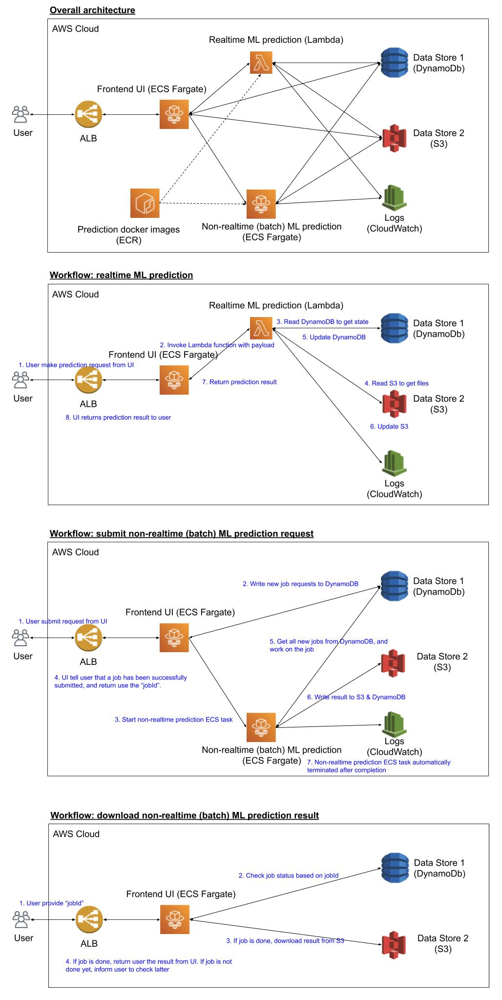

# Machine Learning Application

## Goal

- An `serverless architecture` for hosting `machine learning prototype` that are `scalable`, `easily maintaiable`, and `cost effective` for `research scientists`.

  - The type of machine learnig algoirhtm is not the focus. It is the `serverless architecture` that we are interested in.

    - We choose `serverless` to reduce the on-going maintance work.

  - We are interested in hosting `machine learning prototype`. It is a `prototype`, which means the goal is to demonstrate the machine learning model, and fancy UI is not the focus. For `machine learning`, there are generically two types of predictions. The first type is realtime prediction, that is, prediction that can happen within minutes. The second type is non-realtime (or batch) prediction, that is, prediction that may take minutes to hours to complete. And due to the complexity of machine learing applications, it requires a heavy computing engine, e.g., 10+ GB of memory and/or high-end CPU and/or high-end GPU.

  - The application should be `scalable`. That is, the application should work even if there are 100+ users that is using the application.

  - The application should be `easily maintaiable`. We are a reserach scientists, and not dev ops. We are not interested in spending a lot of time and effort to maintain the application. We want to reduce the maintenance as much as possible.

  - The application shoudl be `cost effective`. In other words, we want to seperate long-running tasks (such as UI frontend) and short-lived compute engine (such as the prediction services). To control the cost, we should NOT createa BIG machine that hosts everything, as it will be expensive.

  - We are `research scientists`. We have greate math skill and can create algorithms to solve business problems. However, we need to way to quickly show the world our achievement.

## Architecture

[Source](https://docs.google.com/drawings/d/1XFEogSXvjYJVDbUxh9cotJs3w1R5XU13H00o495ZPfk/edit?usp=sharing)

### Components

1. DynamoDB
    - It stores state for ML prediction applications.

2. S3
    - It stores the prediction result for ML applications.

3. ECR
    - It stores the docker images for the UI frontend, the realtime ML application, the and non-realtime ML application.

4. Lambda
    - It serves realtime ML prediction using serverless fashion.
    - Our Lambda function is created based on ECR image.

5. ECS (Fargate)
    - We define two ECS Fargate tasks. The first task is frontend UI task, and the second task is non-realtime ML prediction task.
    - The frontend UI task is a long-running task that is serving the UI.
    - The non-realtime ML prediction task is a short-lived task that is responsible for producing non-realtime ML predictions. It will run only if there is new non-realtime jobs to do. And cone all jobs are done, it will auto shutdown (to save cost).

6. Application Load Balancer (ALB)
    - ALB provides a fixed DNS for users to access the UI. It routes traffic to one of the frontend UI tasks.

7. Cloud Watch
    - All services/tasks will write its log to cloud watch for debugging purpose.

### Frontend UI

- The frontend UI is served by ECS Fargate.

- User hit ALB, and ALB route the traffic to one of the ECS Fargate frontend tasks. It is scalable as we can increase the number of frontend tasks easily. And there is no impact to user as the DNS remains the same.

### Backend 1: realtime prediction

- We servce realtime prediction as `invoking a Lambda function`, where the Lambda function is created from the docker image that we pushed to ECR.

  - Since we create Lambda function baesd on a docker image, we can test our Lambda function locally BEFORE we push it. All we need to do is to make sure the docker image can be ran successfully locally, which is what data scientists are very familar with.

  - To simulate the whole `create a Lambda function baed on docker image localy`, we can use the Lambda emulator provided by AWS. See [AWS tutorial here](https://aws.amazon.com/blogs/aws/new-for-aws-lambda-container-image-support/).

  - Since our Lambda function is based on a docker iamge, we can do WHATEVER WE WANT, as long as it can be dockerized. This is a new Lambda feature that was recently released (Dec 2020).

- Since Lambda is serverless and have very good scability, this is a reliable and scalable way for serving realtime prediction.

- Lambda function access DynamoDB and/or S3 for steats and files. DynamoDB and S3 are highly available and scalable. And they require almost no maintenance, which is good for our use case.

- Drawback

  - Inoking Lambda function the frist time takes longer (1 - 5 second in my test), while regular invoking takes shorter (50 milliseconds) This is a well known problem called `cold start`.

  - This problem can be resolved by setting up provisioed concurrency. See [AWS blog](https://aws.amazon.com/blogs/compute/new-for-aws-lambda-predictable-start-up-times-with-provisioned-concurrency/) for more detail.

### Backend 2: non-realtime prediction

- We serve non-realtime prediction by desining it as a `ECS Fargate task`. Once it is started, it will query DynamoDB to find all the new jobs. It will work on the new jobs, and update DynamoDB and/or S3 with the result. When all jobs are done, it will terminate itself.

- There is NO service to manage this task. When user submit a non-realtime job from the UI, the frontend will send this new job information to DynamoDB and `run` the non-realtime task. And cone the task is done, it will terminate itself. This is a very good way to run complex machine jobs without keeping a big long-running machine.

- And since it is based on docker image, we can test the code locally, and only upload it once it works.

### Advantages of this architecture

1. Serverless

    - All the components in the architecdture are serverless. So this means we do not need to manage any instances or servers.

2. Scalable

    - The whole architecture is highly scalable. 

    - If there are too many users accessing UI, we can simply increase the number of frontend tasks (configurable from ECS service definition). There is no interuption to the user as user access UI via ALB.

    - For realtime prediction, it is served by Lambda. So it is scalable by default.

    - For non-realtime prediction, it is a batch processing. So user expect to have some delay.

    - For data store, DynamoDB and S3 are scalable by design. And in case there are too many activities, we can increase the RSU and WSU for DynamoDB table.

3. Relatively easy to set up for a single research/data scientist

    - The `easiest` way to set up machine learning application is to createa a VM, and run all tasks on that single VM. This is the classical architecture, which we know works. However, this architecture is not scalable by design. It is not falt tolerant, and require a lot of maintanance (like manually restart the server, etc).

    - The `ideal` way to set up machine learning application is to pair up data scientist with DevOps. Data scientist is responsible for the core prediction logic, and the devop is responsible for the infrastructure and day-to-day maintenance. Usually, the application is built and deployed via Kubernetes. Since everything can be customized in Kubernetes, you can create a scalable and relible system. However, this require a team and is usually very time consuming.

    - Therefore, if we want a scalable ML system that a single data scientist can build, the architecture proposed here is a good solution. It extensivly leverage AWS manged service, but at the same time proivdes enough flexibility to build our application.

    - In terms of the knowledge required, it is not zero but also not too complicated.

        - Docker

        - AWS services: ECR, ECS, Lambda, DynamoDB, S3, ALB

        - Frontend framework (I use treamlit with Python as the frontend framework)

        - ML prediction (this is what every data scientists already know)

## Development Workflow

TBD

## Operation Cost

See [AWS Fargate pricing](https://aws.amazon.com/fargate/pricing/) for the up-to-date cost.

For the frontend, we hav a very lightweight frontend (0.5 GB of RAM and 0.25 vCPU). Assuming we run this task 24 hours for 30 days, the total cost is $8.88 USD.

For the DynamoDB, we have only 2 RCU and 2 WCU. The monthly cost is about $1.17 USD.

For our backend-application, it only runs if there is new jobs to work on. So the cost is negligible.

## Others

### Lessons Learned

1. Error handling in the code

### Useful information

- Add Application Load Balancer (ALB) to ECS Service

    - https://appfleet.com/blog/route-traffic-to-aws-ecs-using-application-load-balancer/
